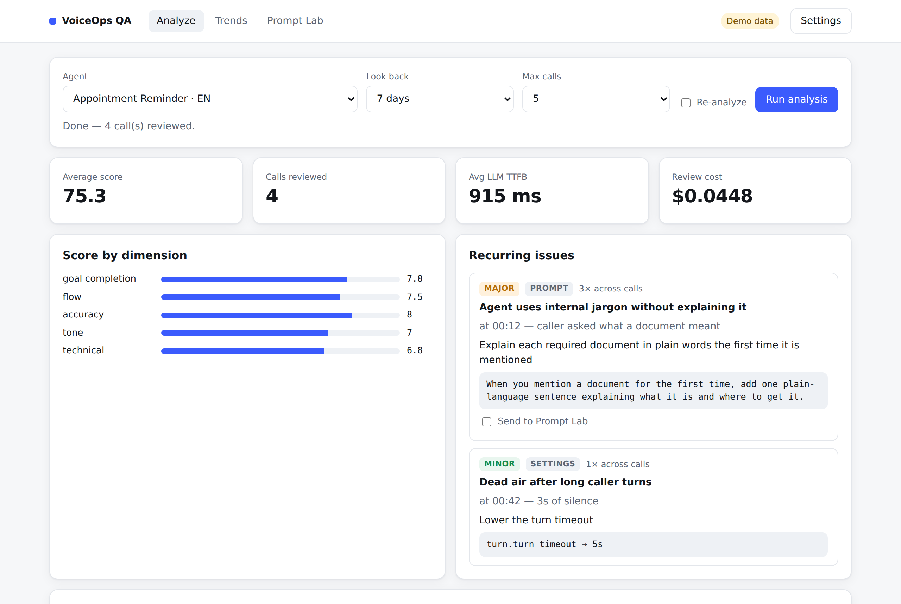
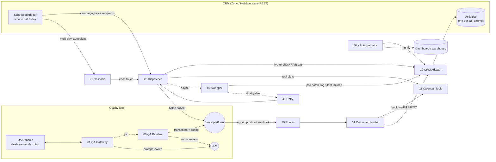

# VoiceOps for n8n

**The plumbing around outbound AI voice agents: dialling, outcomes, retries, KPIs and a QA loop that suggests prompt fixes. It works with any CRM, and you can rebrand it.**

A set of 13 importable [n8n](https://n8n.io) workflows plus a single-file QA console that together run the full lifecycle of an outbound voice-agent program:

> CRM decides who to call → calls go out in batches → every call outcome lands back in the CRM → nobody silently falls through the cracks → retries happen automatically → KPIs are computed nightly → an LLM reviews real calls and proposes prompt fixes → you ship the fix and watch the score move.

It is built around [ElevenLabs Conversational AI](https://elevenlabs.io/conversational-ai) (batch calling + post-call webhooks), Calendly (booking), and Anthropic's Messages API (QA review), with a **pluggable CRM adapter** that ships with Zoho CRM and HubSpot mappings.

 



**▶️ [Try the QA console live](https://bbehnass.github.io/voiceops-n8n/dashboard/)**: it runs in demo mode on made-up calls, so there's nothing to install and no account needed.

---

## Why this exists

Voice agents are the easy part. The hard part is everything around them:

| Problem in the real world | What this repo does about it |
|---|---|
| CRM data is stale by the time you dial | Live **eligibility re-check** right before every batch and every touch |
| Agents "book" slots that don't exist | Only **real calendar availability** is offered; a booking counts only on **HTTP 201** |
| Webhooks can be spoofed or replayed | **HMAC verification over the raw body** + timestamp window |
| Some calls never produce a webhook | A **silent-failure sweeper** polls the batch until it finishes, then logs `Failed` for anyone missing |
| Each new use case = copy-paste a whole workflow | **One config file** defines campaigns; one generic dispatcher, router and outcome handler serve all of them |
| Switching CRM means rewriting everything | All CRM I/O goes through **one adapter workflow** with a canonical data model |
| "Is the agent getting better?" is a feeling | **LLM QA pipeline** with a weighted rubric, recurring-issue clustering, prompt rewrite + diff, and score trends marked with deploy dates |
| A/B tests drift between runs | **Deterministic, salted hashing** assigns arms; arm is written back to the CRM |

## Architecture



Full walkthrough: [`docs/ARCHITECTURE.md`](docs/ARCHITECTURE.md).

## What's inside

| # | Workflow | Role |
|---|---|---|
| 00 | [Config](workflows/00-config.json) | Single source of truth: campaigns, CRM field map, providers, thresholds |
| 10 | [CRM Adapter](workflows/10-crm-adapter.json) | `get_record` · `update_record` · `log_activity` · `search_activities` for Zoho, HubSpot, generic REST |
| 11 | [Calendar Tools](workflows/11-calendar-tools.json) | Real availability + verified booking (Calendly) |
| 20 | [Campaign Dispatcher](workflows/20-campaign-dispatcher.json) | Normalize → A/B → eligibility → slots → batch submit |
| 21 | [Multi-touch Cascade](workflows/21-multi-touch-cascade.json) | D0/D3/D7-style sequences, weekend-aware, data-driven loop |
| 30 | [Post-call Router](workflows/30-post-call-router.json) | HMAC + replay protection, self-describing routing |
| 31 | [Outcome Handler](workflows/31-outcome-handler.json) | Canonical outcomes, verified bookings, one CRM activity per attempt |
| 40 | [Silent-failure Sweeper](workflows/40-silent-failure-sweeper.json) | Batch polling, missing-outcome backfill, retry decision |
| 41 | [Retry Scheduler](workflows/41-retry-scheduler.json) | Bounded retries of voicemail / no answer / failed |
| 50 | [KPI Aggregator](workflows/50-kpi-aggregator.json) | Daily connect / success / realization rates per campaign |
| 60 | [QA Analysis Pipeline](workflows/60-qa-analysis-pipeline.json) | Anonymize → rubric review (JSON) → cluster → store |
| 61 | [QA API Gateway](workflows/61-qa-api-gateway.json) | The console's only backend; keys never reach the browser |
| 90 | [Error Notifier](workflows/90-error-notifier.json) | Any failure → Slack/Teams alert |
| — | [QA Console](dashboard/index.html) | Analyze · Trends · Prompt Lab (runs in **demo mode** with no backend) |

Node-by-node documentation: [`docs/WORKFLOWS.md`](docs/WORKFLOWS.md).

## 🧩 Pick what you need

You don't have to take all of it. Most people start with one piece:

| I want to… | Import these | Accounts you need |
|---|---|---|
| **Score my agent's calls and get prompt fixes** | `00`, `60`, `61` + `dashboard/` | ElevenLabs, Anthropic, a Google Sheet |
| **Receive post-call webhooks safely and log outcomes to my CRM** | `00`, `10`, `11`, `30`, `31`, `90` | ElevenLabs, your CRM (Calendly only if you book) |
| **Run full outbound campaigns** | everything | all of the above |
| **Just borrow a pattern** | read `10` (CRM adapter), `30` (signed webhooks) or `40` (silent-failure sweeper), plus [`docs/ENGINEERING_NOTES.md`](docs/ENGINEERING_NOTES.md) | none |

`00-config` is always needed: every workflow loads its settings from there.

## Quick start

```bash
# 1. import (CLI keeps workflow IDs, so sub-workflow links just work)
n8n import:workflow --separate --input=workflows/

# 2. set secrets
cp config/.env.example .env   # fill in, then restart n8n with these env vars

# 3. in n8n: create credentials, attach them to the HTTP nodes (see docs/SETUP.md)
# 4. edit workflows/00-config → campaigns, field names, agent IDs
# 5. activate 30 (router), 20/21 (dispatch webhooks), 50 (KPIs), 61 (QA gateway)
```

Try the console without any backend: open [`dashboard/index.html`](dashboard/index.html) — it starts in demo mode with synthetic data.

Full setup, credentials and testing: [`docs/SETUP.md`](docs/SETUP.md).

## 🎨 Make it yours

Nothing in here belongs to a specific company. Everything that makes it *yours* is a setting:

- **Name, logo and colours**: edit the `BRAND` block at the top of [`dashboard/index.html`](dashboard/index.html). Set a name, point `logoUrl` at your logo file and pick an accent colour. Empty values keep the neutral defaults.
- **Campaigns, CRM fields, agent IDs, thresholds**: all in `workflows/00-config`.
- **Secrets**: `config/.env.example` → `.env`. No key is ever written into a workflow or the dashboard.

## Adapting it

- **Another CRM** → add one branch to the adapter's *Build request* node and its normalizer. See [`docs/CRM_ADAPTERS.md`](docs/CRM_ADAPTERS.md).
- **Another use case** → add a campaign object in `00-config`. No new workflow needed.
- **Another calendar** → replace `11-calendar-tools` keeping its input/output contract.
- **Another voice platform** → the dynamic-variable and outcome contract is documented in [`docs/VOICE_AGENT_CONTRACT.md`](docs/VOICE_AGENT_CONTRACT.md).

## Design notes

The decisions, trade-offs and bugs this architecture is designed to avoid are written up in [`docs/ENGINEERING_NOTES.md`](docs/ENGINEERING_NOTES.md) — item pairing in batch flows, string-templated JSON, silent webhook loss, verifying the bytes you parse, and more.

## Privacy

Transcripts are anonymized (known contact names, emails, phone numbers, postcodes, street addresses) **before** they are sent for LLM review. The console never holds provider API keys. See [`docs/QA_TOOL.md`](docs/QA_TOOL.md#privacy).

## 🚧 Status

The patterns come from running AI voice campaigns in production. This repo is a clean-room rebuild of them, written from scratch for anyone to reuse, with no employer code, data, branding or identifiers. The workflows are syntax-checked and wired together, and the dashboard runs in demo mode. This public version hasn't been run end to end against a live CRM yet, so expect to adjust field names for your setup. That's what the config is for.

## Author

**Bousseif**, BizOps / AI Ops. I designed the architecture, the data model and the failure handling, and decided what each workflow is responsible for. AI wrote most of the code, and I reviewed it, tested it and pushed back on it.

MIT licensed. Use it, change it, ship it.
