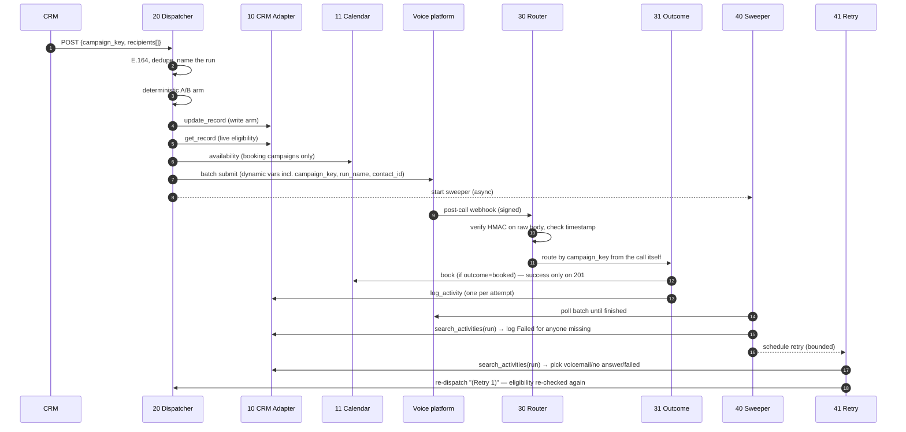

# Architecture

## The lifecycle of one call



## Layers

| Layer | Workflows | Knows about |
|---|---|---|
| **Config** | 00 | Everything tunable. Nothing else hardcodes a campaign, field name or threshold. |
| **Ports** (swap per vendor) | 10 CRM, 11 Calendar | One vendor each. Everything above them speaks a canonical model. |
| **Orchestration** | 20, 21, 30, 31, 40, 41 | Campaign semantics. Vendor-neutral except the voice API. |
| **Analytics** | 50 | Canonical activities only. |
| **Quality loop** | 60, 61, dashboard | Voice platform + LLM. Independent of the CRM. |
| **Ops** | 90 | Failures anywhere. |

## Canonical data model

**Recipient** (what a CRM trigger sends)
```json
{ "id": "crm-record-id", "name": "Alex Doe", "phone_number": "07700 900123", "email": "a@example.com",
  "variables": { "any_extra_dynamic_variable": "value" } }
```

**Activity** (what the adapter returns from `search_activities`)
```json
{ "id": "activity-id", "contact_id": "crm-record-id", "run_name": "Missed Appointment 2026-09-25 (Retry 1)",
  "outcome": "Voicemail", "started_at": "2026-09-25T10:04:00Z" }
```

**Run name** is the join key of the whole system: `"{campaign label} {local date}[ (Touch n)][ (Retry n)]"`.
It is the batch name on the voice platform, the activity subject in the CRM, and the scope of every sweep and retry. Prefix = campaign; suffixes = attempt lineage.

## Why these boundaries

- **Generic handler over one-workflow-per-use-case.** Every use case used to mean a new batch workflow, a new post-call workflow, and a new router branch. Differences between use cases turned out to be *data* (agent, timezone, booking on/off, eligibility rules, outcome keys), so they live in config. A campaign can still opt into a custom handler with `handler_workflow_id`.
- **Self-describing calls.** `campaign_key` and `run_name` ride along as dynamic variables, so routing needs no extra API lookup and survives batch renames. The batch-name prefix match remains as a fallback.
- **Ports own pagination and error shapes.** Callers never see `more_records` or `paging.next.after`; they get one flat list.
- **Asynchronous safety nets.** The dispatcher returns as soon as the batch is submitted; the sweeper and retry run on their own clocks and are resumable (n8n persists long waits).

## Failure model

| Failure | Detection | Result |
|---|---|---|
| Bad/stale signature | Router | `401`, nothing written |
| Unknown campaign on a webhook | Router throws | Error notifier alert |
| Call with no webhook | Sweeper after batch completes | `Failed` activity, eligible for retry |
| Agent books an unavailable slot | Calendar returns ≠201 | `Booking failed` activity with the API's reason |
| CRM write rejected | Outcome handler asserts | Execution fails → alert (and the webhook was already acknowledged) |
| No availability for a booking campaign | Dispatcher throws before dialling | Alert, nobody called |
| Person no longer eligible at touch/retry time | Dispatcher filter | Skipped, not called |
